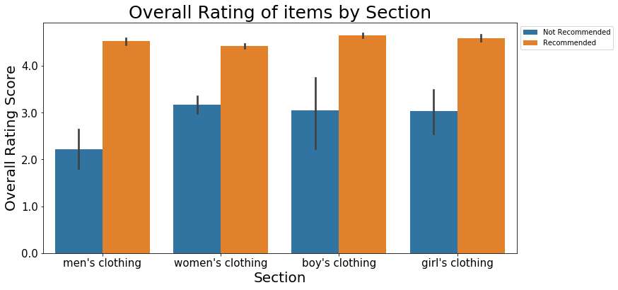
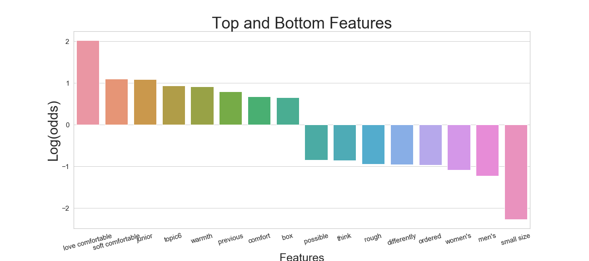
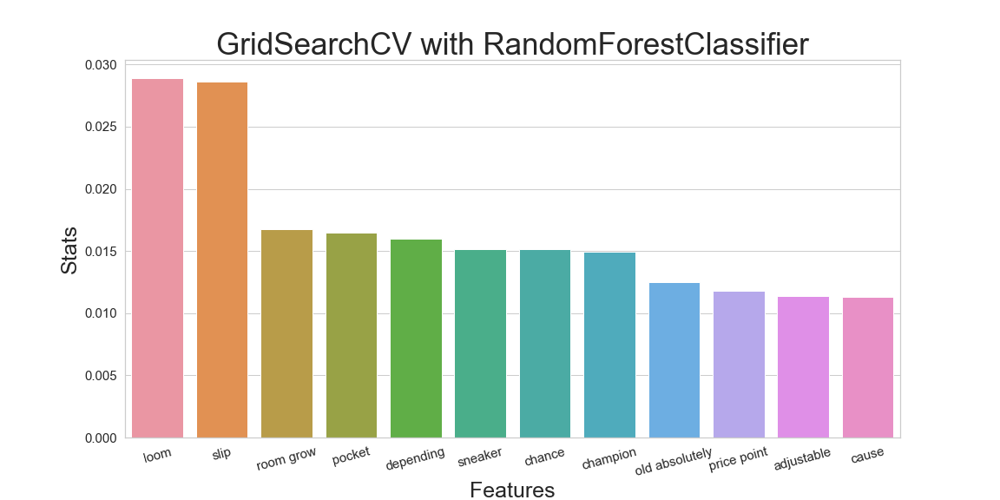

# <u> Walmart Reviews Analysis</u>


---
---
# Business Motivation

2020 has been a hectic year, and it has reinforced the importance of technology across all sectors, perhaps none more so than the retail sector. Walmart's motto and philosophy is "Save Money, Live Better", and in order for Walmart to live up to  that standard , they need to be able to provide the "best" items for their customers based on the customer's wants and needs, both in store and online.

Walmart is known for being the [King of retail stores](https://www.pioneeringminds.com/walmart/) , but this is in large part due to the success of its physical stores. Starting in 2017, Walmart developed a strong initiative to strengthen its online presence. In the first quarter of 2020, amidst the pandemic, Walmart saw a [74% increase in online sales in the first quarter](https://www.supermarketnews.com/retail-financial/walmart-sees-q1-us-comps-jump-10-online-sales-soar-74) as people began working from home and required goods to be delivered directly to their door due to limited access to physical locations.

Due to this newfound need to shop online, customer ratings, reviews and recommendation scores are crucial factors in another customer's decision to purchase an item.
After analyzing customer reviews, using Natural Language Processing, as well as other features such as LDA Topic Modeling and price, I used machine learning to extract key features that lead to a customer recommending or not recommending an item. These features can then be used to guide Walmart's online marketing/product campaigns.
Walmart's marketing team can use my model and its findings to promote particular items that resonate best with customers.

For example, my model determined that comfort and fit tend to drive a customer to recommend an item. If an item does not fit well, then it’s not comfortable and not worth the purchase; however, if an item is true to size and fits well, then it is comfortable and highly recommended. Therefore, Walmart could market items such as "Jeans that are always TRUE TO SIZE" and "New ComFIT (comfortable-fit) products to WFH (work from home)".


## Goal
This analysis will look at Walmart clothing reviews to find key features that predict whether a customer will recommend an item or not. The features that guide the predictions can then used to guide Walmart's online and/or in-store marketing/product campaigns. This investigation will be conducted using [Natural Language Processing](https://en.wikipedia.org/wiki/Natural_language_processing) packages and libraries. 

## Data
Data is scraped directly from the Walmart webpage between November 27 to November 30 using [Selenium](https://www.selenium.dev/) and [BeautifulSoup](https://en.wikipedia.org/wiki/Beautiful_Soup_(HTML_parser)) . The webpage urls and item links can be found in [item_links folder](https://github.com/dorjeys3/Walmart_proj/tree/master/data/item_links) and in the [scraper notebook](https://github.com/dorjeys3/Walmart_proj/tree/master/Walmart_scraper) as well. 

One of the obstacles of scraping Walmart was the Captcha that it would require you complete. This maybe due to the high number of requests received by Walmart server from the scraping. To get around this, you can either extend the ```time.sleep()``` method or use a VPN. I used a VPN and although successful, it still ran into captchas. 

Overall, I was able to obtain 1,225 observations (308 men's items, 471 women's items, 154 boys' items and 292 girls' items). After data cleaning and preprocessing, this number was 1,149 observations. These dataframes can be found in the ```item_review``` folder or [here](https://github.com/dorjeys3/Walmart_proj/tree/master/data/Item_review).   



## Methods
Since this dataframe consist of both continuous variables and text, the project was divided into three notebooks:

1. [Data cleaning](https://github.com/dorjeys3/Walmart_proj/blob/master/1_walmart_product_review_nlp.ipynb) for the continuous variables 
2. [Data preprocesing](https://github.com/dorjeys3/Walmart_proj/blob/master/2_walmart_product_review_nlp.ipynb) for the text
3. [Modeling](https://github.com/dorjeys3/Walmart_proj/blob/master/3_walmart_product_review_nlp.ipynb) with feature extractions

### Data Cleaning:

This notebook consist of removing all duplicates in the dataframe as well as cleaning the continuous variables. These variables contained unnecessary noise generated through scraping and unwanted text and symbols. There are four continuous variables:

* price
* overall rating score for the item
* the number of people who rated the item
* the recommended score. 

Additionally, this notebook contains some preliminary exploratory data analysis on the the continuous variables. 


### Data Preprocessing: 
Once the continuous variables were cleaned and saved as a new dataframe, it was imported to this notebook for preprocessing the text data. The main focus in this notebook was the reviews given by the customers who had purchased the items. All reviews were grabbed together for each item, therefore all reviews appear in one row. Thess reviews were then cleaned and processed using:

* Regular Expression (Regex)
* Tokenizer
* Removal of stopwords
* Lemmatization
* Latent Dirichlet Allocation (LDA) Topic Modeling

The clean dataframe was then pickled for modeling. Pickle method was used because saving the clean dataframe as ```.csv``` file was corrupting and introducing unwanted noise, requiring additional cleaning and defeating the purpose of notebook 1 and 2. 


### Modeling
Once the text and continuous variables were cleaned and processed. Train-Test split was initialized. TfidfVectorization was used after Train-Test split to prevent data leakage. CountVectorization was also used but TfidfVectorization produced better results.
The models used were:

* Logistic Regression
* Bernoulli Naive Bayes
* Support Vector Classifer - Radial Basis Funciton
* Random Forest Classifier
* GridSearchCV with Random Forest Classifier 
* GridSearchCV with Logistic Regression

Since the goal of this project and analysis is to find features that would point towards items being recommended or not recommended, it would be best to focus on interpretable models. Additionally, to adderss the class imbalance, we will be using the ```class_weight='balanced'``` for most of the models. 

## Results
Overall, the F1 score for all the models scored fairly well. The reason I chose F1 score as a metric is because it takes both percision and recall into account. 


Since I want to be able to suggest Walmart's Marketing Team the features that customer's seem to be basing their recommendation, we would want to use the most interpretable model. In this case, I use the Logistic Regression's coefficients to get the important features. I discover that "comfort", "comfortable" and topic 6, generated from LDA model, seem to be some of the features that tend to lead customers to recommened the item. 




Since Random Forest is a Black Box model, we cannot say exactly how these important features will affect the customers decisoin. But when put side by side with logistic Regression, the features extracted from GridSearchCV with RandomForest corroborats and supports the findings from the Logistic Regression. 

## Conclusion

My models produced a decent F1 score and the features extracted from the Logistic Regression and GridSearchCV with RandomForest Classifier support each other. Therefore, my recommendation to Walmart marketing team would be to promote items that are true to size. If items fit well, then it is often recommended. Additionally, a proper fit is also "comfortable" and my analysis found that "comfort" drives recommendation.  Whereas, Customer's having to return products due to sizing issues seem to push items to being non-recommended. 

One way to tackle this would to be do additional research and tests on the partner brands to see how ture to size their products are. 

Additionally, it seems like quality control needs to be addressed. 

* "When we opened the vacuum sealed packaging that this Mario suit came in, we were completely overwhelmed by a smell of mold and mildew."
* "First, the sweater came smelling really bad like vinegar. Worst of all, the design came off after just one wash!"

Walmart partners with brands, large and small, and sells their items online. However, when items are received by the customers in bad condition, Walmart receives the blame causing their public image to be degraded. 

## Next Steps
During this analysis, I discovered that Brand's would get compared to each other in the reviews. For example, an inner wear item, Disney Junior Toddler Girls Sofia the First, was compared to Fruit of The Loom.

* "Seams are starting to unravel after first use. Spend the extra money on Hanes brand or Fruit of a Loom..so disappointed..."

Therefore, I would like to see if there are certain brands that do better than others. This finding could also influence how Walmart might market the products. 

Another place I would like to spend more time is exploring whether lemmatize or stemming should even be considered. For instance, "Slip" was lemmatized from Slippers, slippery, slips, slipping. Slip was being refered correctly at itmes, where customers were talking about how the elastic does not perform well and causes the pants to slip and the item was not recommended. And other times, it was lemmatized from slippers

* 'Hubby also claims they slip down easily if not tied tightly.

* 'I sadly had to return my ballet slipper pink because I ordered the wrong size.'
Since the items were scraped towards winter, most of the displayed items were related to the winter items. Another step that I would like to take would be scraping Walmart every season to see how the reviews differ among the seasons. 

## For More Information

For further clarificaiton or inquiries you can email: ```dorjeys3@gmail.com```.

* LinkedIn: [Dorjey Sherpa](https://www.linkedin.com/in/dorjey-sherpa-45501814a/)
* Twiter: [dorjeys3](https://twitter.com/dorjeys3)


## Repository Structure

<pre>
.Walmart Reviews Analysis
├── 1_walmart_product_review_nlp.ipynb
├── 2_walmart_product_review_nlp.ipynb
├── 3_walmart_product_review_nlp.ipynb
├── README.md
├── Walmart\ Review\ Analysis.pdf
├── Walmart_scraper
│   ├── walmart_Items_scraper.ipynb
│   └── walmart_review_scraper.ipynb
├── data
│   ├── Item_links
│   │   ├── Walmart_link_df.ipynb
│   │   ├── mens_links_df.csv
│   │   ├── walmart_boys_links.csv
│   │   ├── walmart_girls_links.csv
│   │   ├── walmart_women_links.csv
│   │   ├── womens_athletic_links_df.csv
│   │   ├── womens_clothing_links_df.csv
│   │   └── womens_links_df.csv
│   ├── Item_review
│   │   ├── walmart_boys_clothing_reviews.csv
│   │   ├── walmart_girls_clothing_reviews.csv
│   │   ├── walmart_reviews.csv
│   │   └── walmart_womens_reviews.csv
│   ├── clean_df.csv
│   ├── cleaning_df.csv
│   └── modeling_df.pkl
├── images
│   ├── f1score.png
│   ├── grid_tree.png
│   ├── items_no_reviews.png
│   ├── log_coef_feats.png
│   ├── overall_rating.png
│   ├── price_rec.png
│   ├── rating_bins.png
│   ├── rating_section_target.png
│   ├── recommended_dist.png
│   ├── target.png
│   └── walmart_logo.png
└── scripts
    └── scripts.py</pre>
mad